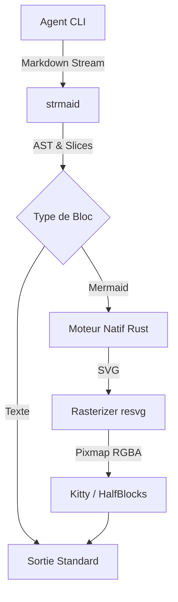
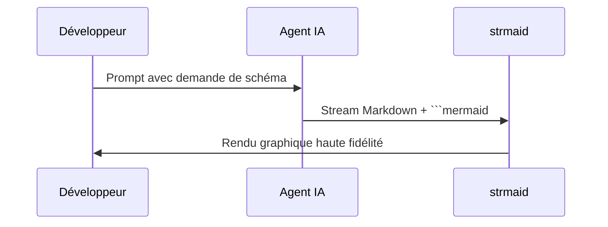
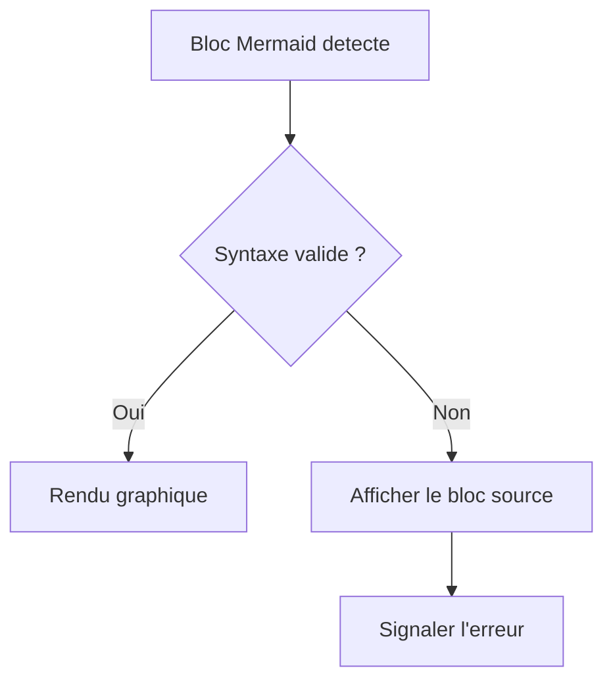

# Rapport d'Architecture IA

Voici un exemple de documentation technique généré par un agent.

## Flux de Traitement

## Diagramme de Séquence

## Cas Dégradé (Syntaxe Invalide)

Fin du document.
